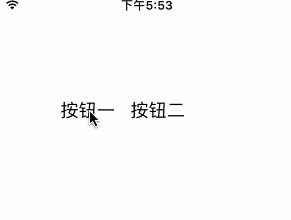

最近发现关于 `UIButton` 状态的一个挺有意思的问题，大概就是：

> 当一个按钮处于选中状态，也就是 `selected` 为 `YES` 时，如果这时候再点击它时，按钮会变成 `normal` 状态时候的样子！

问题效果大概这样：



因为只是个 `Demo` ，所以代码写的比较随意，就是设置按钮不同状态下的呈现：

```objc
#import "ViewController.h"

@interface ViewController ()

@property (strong, nonatomic) UIButton *btn1;
@property (strong, nonatomic) UIButton *btn2;

@end

@implementation ViewController

- (void)viewDidLoad {
    [super viewDidLoad];
    // Do any additional setup after loading the view, typically from a nib.
   
    UIButton *btn1 = [UIButton buttonWithType:UIButtonTypeCustom];
    btn1.frame = CGRectMake(100, 100, 60, 30);
    [btn1 setTitle:@"按钮一" forState:UIControlStateNormal];
    [btn1 setTitleColor:[UIColor blackColor] forState:UIControlStateNormal];
    [btn1 setTitleColor:[UIColor redColor] forState:UIControlStateSelected];
    [self.view addSubview:_btn1 = btn1];
    [btn1 addTarget:self action:@selector(btn1Click) forControlEvents:UIControlEventTouchUpInside];
    
    UIButton *btn2 = [UIButton buttonWithType:UIButtonTypeCustom];
    btn2.frame = CGRectMake(170, 100, 60, 30);
    [btn2 setTitle:@"按钮二" forState:UIControlStateNormal];
    [btn2 setTitleColor:[UIColor blackColor] forState:UIControlStateNormal];
    [btn2 setTitleColor:[UIColor redColor] forState:UIControlStateSelected];
    [self.view addSubview:_btn2 = btn2];
    [btn2 addTarget:self action:@selector(btn2Click) forControlEvents:UIControlEventTouchUpInside];
}

- (void)btn1Click {
    if(_btn2.isSelected) {_btn2.selected = NO;}
    _btn1.selected = YES;
}

- (void)btn2Click {
    if(_btn1.isSelected) {_btn1.selected = NO;}
    _btn2.selected = YES;
    
}

@end
```
我们可以发现，这里分别设置了按钮 `UIControlStateNormal `和 `UIControlStateSelected` 状态的标题颜色，那么该如何解决呢？

分别加上这两句就可以了：

```objc
[btn1 setTitleColor:[UIColor redColor] forState:UIControlStateSelected|UIControlStateHighlighted];

[btn2 setTitleColor:[UIColor redColor] forState:UIControlStateSelected|UIControlStateHighlighted];
```
至于为什么，我们可以看看 `UIControlState` 枚举的定义：

```objc
typedef NS_OPTIONS(NSUInteger, UIControlState) {
    UIControlStateNormal       = 0,
    UIControlStateHighlighted  = 1 << 0,                  // used when UIControl isHighlighted is set
    UIControlStateDisabled     = 1 << 1,
    UIControlStateSelected     = 1 << 2,                  // flag usable by app (see below)
    UIControlStateFocused NS_ENUM_AVAILABLE_IOS(9_0) = 1 << 3, // Applicable only when the screen supports focus
    UIControlStateApplication  = 0x00FF0000,              // additional flags available for application use
    UIControlStateReserved     = 0xFF000000               // flags reserved for internal framework use
};
```

我们可以发现，这是个 `NS_OPTIONS` 类型的枚举，如果对 `NS_OPTIONS` 不太理解的，可以去看下叶大的这篇文章里面的解释 [SDWebImage源码解析之SDWebImageManager的注解(2)](http://www.jianshu.com/p/0f9a7296f4c0)，我这里就不废话了。

既然是 `NS_OPTIONS` 类型，就表示按钮的状态可能存在多重的情况。比如上面选中状态下再点击，可以理解为 **选中|高亮** 状态，也就是  `UIControlStateSelected|UIControlStateHighlighted`。

### 题外话

这种问题常出现在类似**网易新闻 APP** 首页的这种界面设计下：


很多大厂的 APP 同样存在这种问题，比如淘宝、京东、新浪微博什么的，搞得我现在每次一看到这种界面，我都会把玩一下，遇到有问题的会心里忍不住吐槽下，没问题的会有种遇到英雄相惜的感觉，哈哈哈，手动滑稽~
